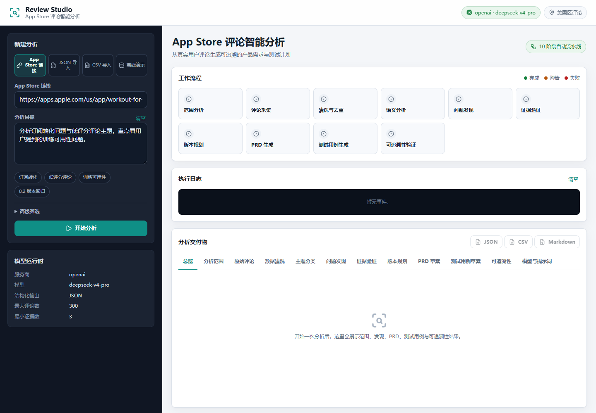
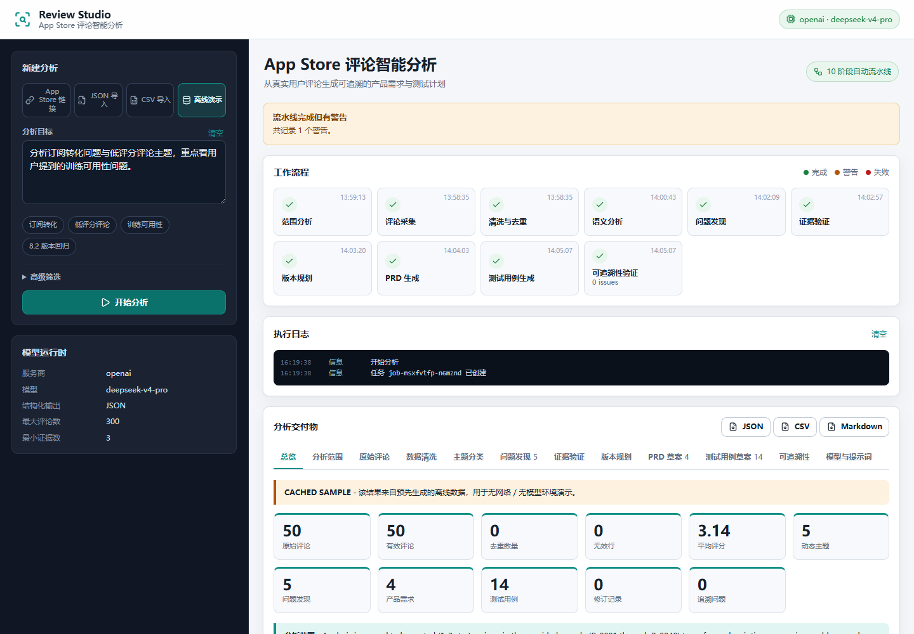
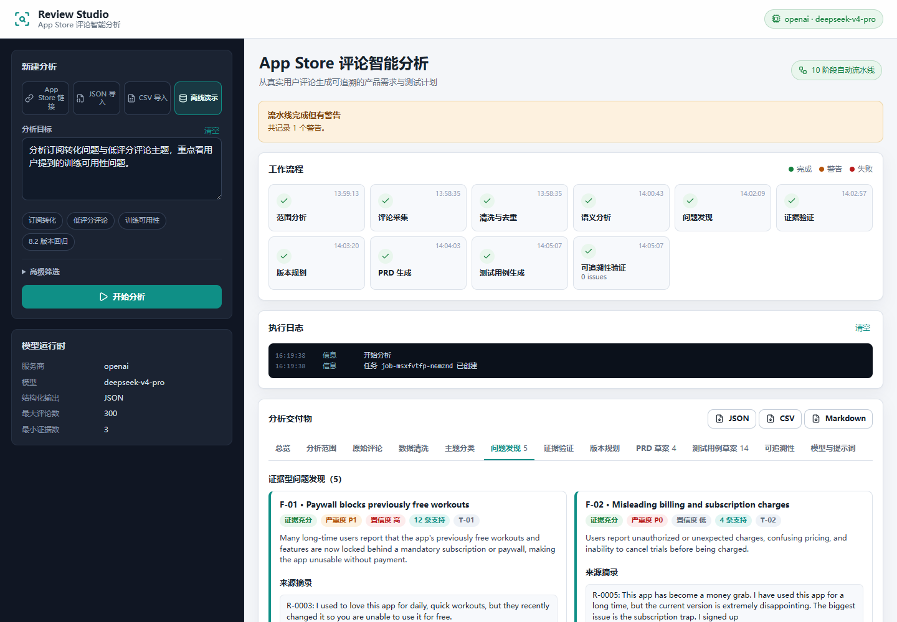
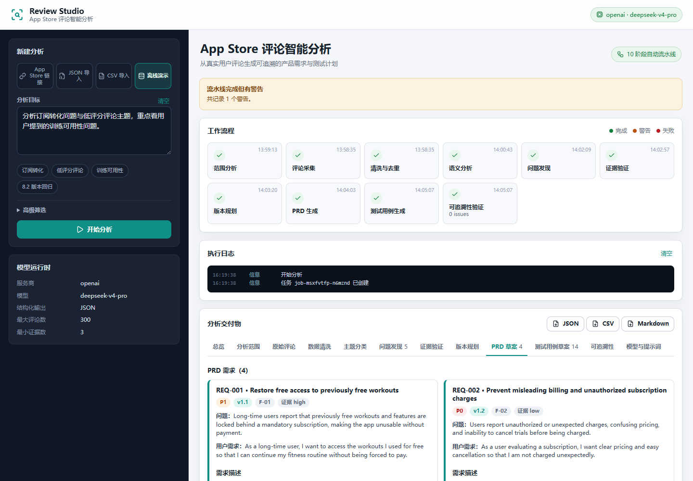
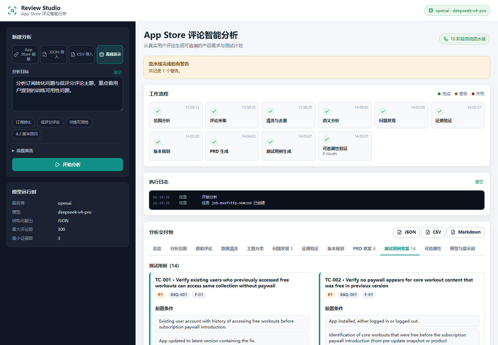
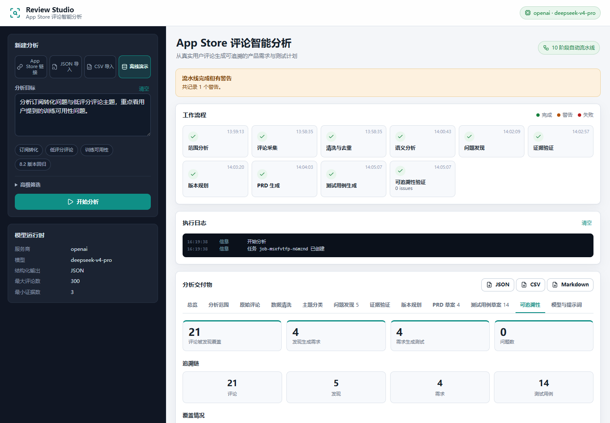

# App Store Review Studio

Model-driven App Store review analysis that turns real customer reviews into an
evidence-grounded product plan:

`Review -> Finding -> Requirement -> Test Case`

中文简介：这是一个可本地运行的 App Store 评论智能分析工具。输入任意美国区 App
链接、JSON/CSV 评论数据或离线演示数据后，系统会自动完成采集、清洗、模型语义
分析、证据验证、版本规划、PRD 与测试用例生成，并在中文 Web 界面中展示全过程。
所有产品结论都可以追溯到真实用户评论。

The app accepts any valid U.S. App Store URL, a JSON/CSV review import, or a clearly
labeled cached sample, then runs this workflow in the browser:

1. Scope analysis
2. Review collection from the official App Store RSS feed (U.S. storefront)
3. Deterministic cleaning, normalization, and deduplication
4. Model-driven dynamic topic discovery and classification
5. Evidence-grounded finding generation
6. Evidence validation (support counts, conflicts, uncertainty)
7. Version planning
8. PRD generation
9. Test case generation
10. Traceability validation

Every finding, requirement, and test case must trace back to real review IDs. The
application does not hardcode app-specific categories; topics, findings, PRD
requirements, version names, and test cases are generated from the input dataset and
analysis goal at runtime. Findings include a P0-P3 severity, confidence, support
counts, and conflicting evidence; the web UI is fully localized in Chinese.

## Quick Start

Prerequisites: Node.js 20 or newer.

```bash
npm install
cp .env.example .env
npm start
```

Open [http://127.0.0.1:8787](http://127.0.0.1:8787).

Set `LLM_PROVIDER`, `OPENAI_BASE_URL`, `OPENAI_API_KEY`, and `OPENAI_MODEL` in `.env`
to enable model-driven semantic analysis. The bundled demo mode works without an API
key because it reads a precomputed cached result.

### Switching Models

No source code change is required. The LLM layer is OpenAI-compatible and also
supports local Ollama:

```env
# OpenAI
LLM_PROVIDER=openai
OPENAI_BASE_URL=https://api.openai.com/v1
OPENAI_API_KEY=sk-xxx
OPENAI_MODEL=gpt-4o-mini
```

```env
# DeepSeek
LLM_PROVIDER=openai
OPENAI_BASE_URL=https://api.deepseek.com
OPENAI_API_KEY=sk-xxx
OPENAI_MODEL=deepseek-v4-pro
```

```env
# Local Ollama
LLM_PROVIDER=ollama
OLLAMA_BASE_URL=http://127.0.0.1:11434
OLLAMA_MODEL=qwen2.5:7b
```

The repository already ships:

- Real U.S. App Store review sample: `data/sample/raw_reviews.json`
- Precomputed demo result: `data/sample/cached_result.json` (clearly labeled `CACHED SAMPLE`)
- Prompt definitions: `prompts/*.md`
- Example environment file: `.env.example`

## Screenshots

### 首页



### 分析总览



### 问题发现



### PRD 草案



### 测试用例草案



### 可追溯性



## Data Collection

Live mode uses Apple's official iTunes RSS customer reviews feed, not page scraping:

```
https://itunes.apple.com/us/rss/customerreviews/id={appId}/sortBy=mostRecent/json?page={page}
https://itunes.apple.com/us/rss/customerreviews/id={appId}/sortBy=mostHelpful/json?page={page}
```

Implementation details are documented in [docs/DATA_COLLECTION.md](docs/DATA_COLLECTION.md):

- Reviews are always fetched from the U.S. storefront, even when the user pastes a
  `apps.apple.com/cn/...` URL for app information.
- Pagination, request rate limiting, retries, soft-block detection, and duplicate
  removal are deterministic.
- When Apple temporarily returns an empty feed, the collector retries both sort
  orders and the UI offers Retry / JSON / CSV / Demo recovery actions.
- Apple's feed exposes a limited, recent subset of reviews. For the sample app, the
  feed returned 50 unique reviews even though the app has hundreds of thousands of
  ratings. This limitation is surfaced in the UI and in the cached result.

## Import Format

JSON:

```json
[
  {
    "review_id": "R-001",
    "rating": 1,
    "title": "Subscription issue",
    "content": "I thought this feature was free...",
    "version": "8.2.0",
    "date": "2026-08-01",
    "language": "en"
  }
]
```

CSV:

```csv
review_id,rating,title,content,version,date,language
R-001,1,Subscription issue,I thought this feature was free...,8.2.0,2026-08-01,en
```

Field aliases are accepted (`id`, `review`, `body`, `comment`, `updated`,
`created_at`, `author_name`, `votes`, and more). See
[docs/IMPORT_FORMAT.md](docs/IMPORT_FORMAT.md) and
[data/sample/review_import_sample.json](data/sample/review_import_sample.json).

## AI Usage

The model is the semantic engine; deterministic code owns data integrity and validation.
Stage-by-stage rationale for choosing rules, statistics, or the model is documented in
[docs/METHODOLOGY.md](docs/METHODOLOGY.md).

Default configuration used to generate the cached demo:

- Provider: OpenAI-compatible DeepSeek API
- Model: `deepseek-v4-pro`
- Temperature: `0.2`
- Structured output: JSON enforced by prompt schema and application-side validation

Model tasks:

- Scope refinement
- Dynamic topic discovery
- Review classification
- Finding consolidation
- Semantic evidence validation
- Version planning
- PRD requirement generation
- Test case generation

Every model call is retried with backoff, and every model-generated reference is
validated against the real cleaned review set. Unsupported findings are rejected,
revised, or marked as assumptions; deterministic statistics are stored separately
from model conclusions. See [docs/AI_USAGE.md](docs/AI_USAGE.md) for full details.

## Cached Sample

`data/sample/cached_result.json` was generated from the real U.S. sample reviews with
`deepseek-v4-pro`. Demo mode loads this file directly and labels it `CACHED SAMPLE`;
it never pretends to be a live run. The same data can be re-analyzed live through the
JSON import tab, or a new URL can be analyzed through the App Store URL tab.

Successful live runs are also saved automatically to `data/cache/live/` (gitignored)
so an analysis can be reviewed again without re-running the model.

## Tests

```bash
npm test
```

The test suite covers language detection, normalization, cleaning/deduplication,
JSON/CSV import, scope parsing and filtering, evidence validation, traceability, and a
full pipeline run with a deterministic mock provider.

## Evaluation Criteria Mapping

- Real, repeatable data: official U.S. App Store RSS feed with documented limits
- Cleaning and analysis: deterministic cleaning plus model-driven topic discovery
- Generalization: no app-specific hardcoded taxonomy, findings, requirements, or tests
- Evidence grounding: every finding/requirement/test case carries source review IDs
- Contradictions and uncertainty: conflicting evidence, confidence, and assumptions
- Traceability: Review -> Finding -> Requirement -> Test is validated automatically
- Local run: `npm start`, demo mode works without API access
- Full history: multi-commit Git history shows implementation and iteration

## Job Description Alignment

The project directly exercises the AI Agent and product-research skills from the
LaienTech internship description:

- Prompt Engineering: 8 externalized prompt files with structured JSON contracts
- Model APIs: OpenAI-compatible provider works with OpenAI, DeepSeek, Qwen, Moonshot,
  and local Ollama without code changes
- Agent / automation workflow: a 10-stage pipeline coordinates collection, cleaning,
  semantic analysis, validation, PRD, and test generation
- Tool chain: RSS collector, deterministic validators, evidence checks, and
  traceability graph validation form an explicit tool/validation loop
- Product research: real App Store reviews become prioritized PRD requirements and
  test cases grounded in source review IDs
- Data analysis: rating distributions, topic stats, support counts, conflicts, and
  confidence are computed deterministically and separated from model conclusions

## Development History

The repository keeps iterative commits rather than a single snapshot. `git log
--oneline` shows scaffold, collector, cleaning, model-driven analysis, pipeline,
UI, tests, cached demo, and follow-up fixes for real edge cases such as Apple feed
soft-blocking, CN-only apps, model timeouts, and port conflicts.

## API

- `GET /api/config` - runtime configuration and model status
- `POST /api/analyze` - start an analysis job
- `GET /api/jobs/:id` - job snapshot
- `GET /api/jobs/:id/events` - Server-Sent Events stream
- `GET /api/prompts` - prompt definitions used by the model

## Project Structure

```text
src/               server, pipeline, collectors, LLM, analysis modules
prompts/           model prompts
public/            web UI
data/sample/       real review sample and cached demo result
tests/             Node test suite
scripts/           sample collection and cache generation
docs/              methodology and AI usage documentation
```

## Environment Variables

See `.env.example`. API keys are loaded only from the environment or `.env` and are
gitignored.
